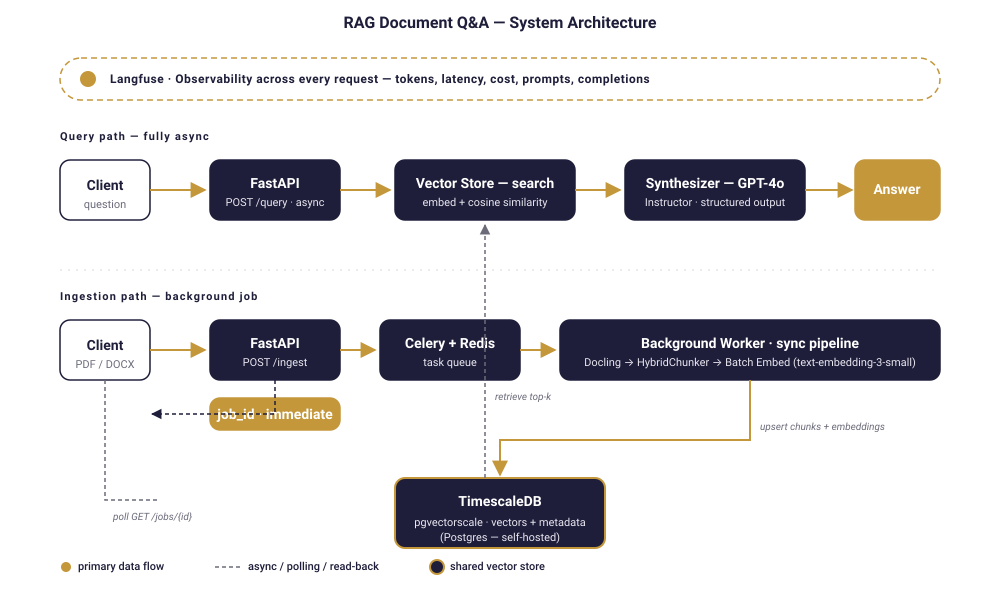
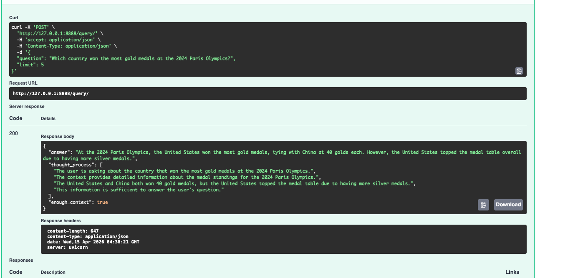
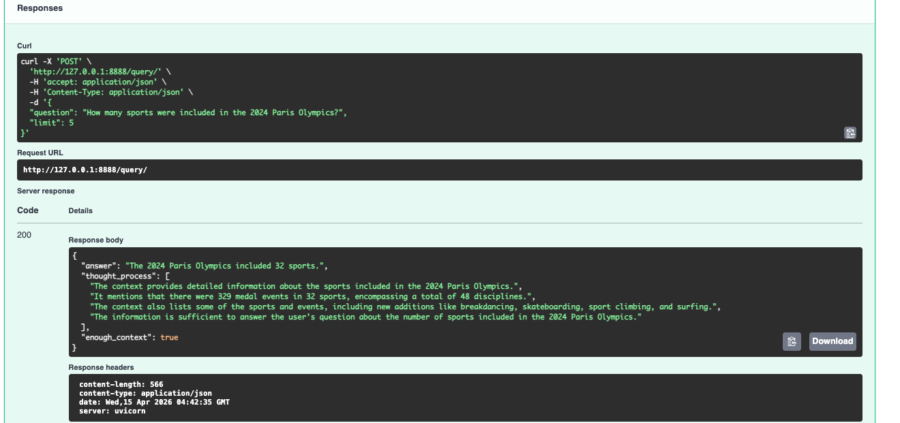
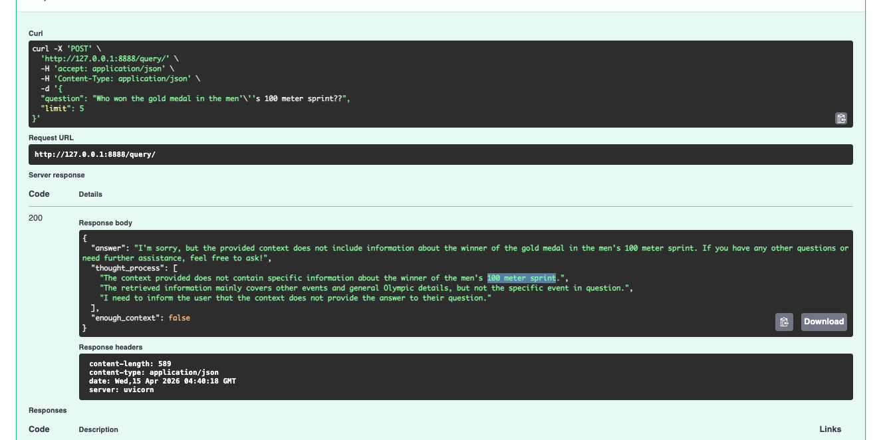
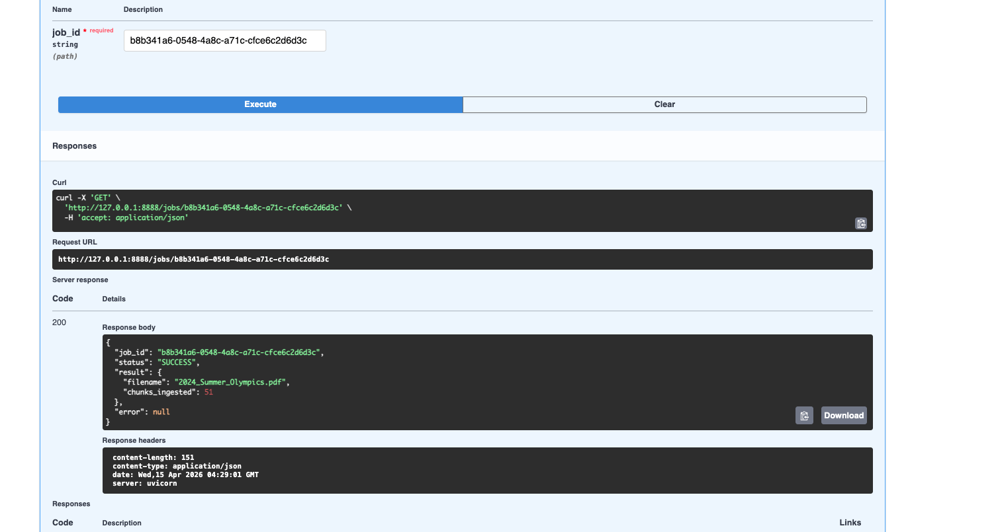
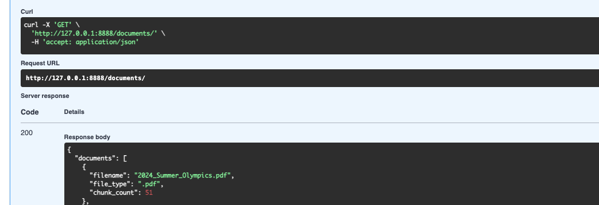
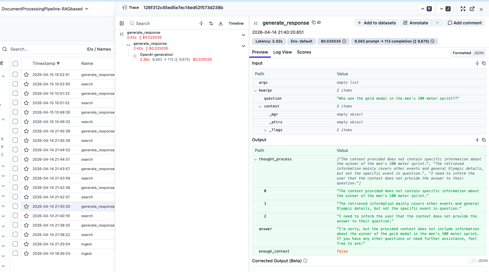
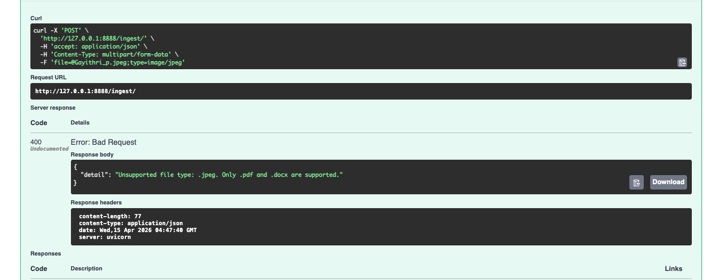
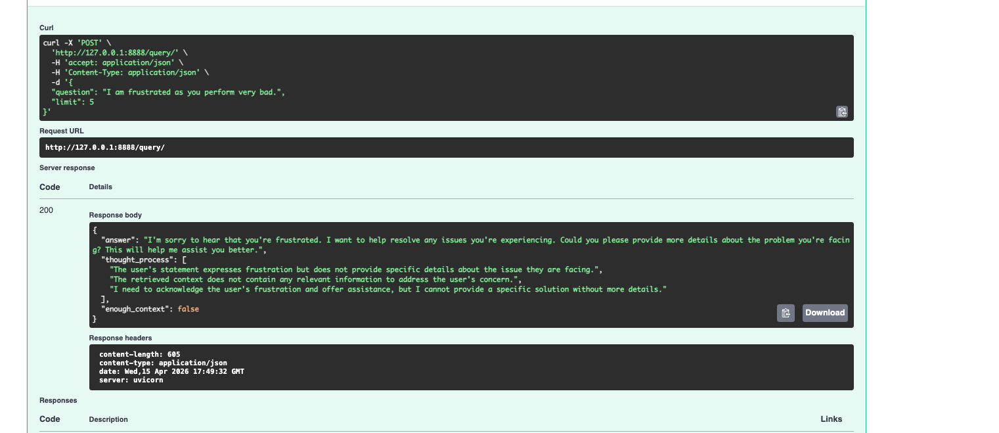

# How I Built a Production-Ready AI Document Q&A System — And What Makes It Different

Almost every client I talk to has some version of the same problem. "We have all the information. We just can't find it fast enough." The contract is somewhere on the shared drive. The policy update is buried in the third revision of a 40-page PDF. Someone on the team spends two hours digging through a report to answer a question that, honestly, should take two minutes.

AI is supposed to fix this. And sometimes it does — but a lot of what I see out there is either a weekend notebook pretending to be a product, or a flashy cloud demo that quietly bleeds money the moment you try to run it at real scale. I wanted to build something in between: a system that's actually usable in production, that I'd be comfortable handing to a paying client, and that doesn't fall apart the moment someone uploads a real document.

<!-- more -->

So that's what I did. Here's the walkthrough.

## Why a Document Processing Pipeline Specifically

A document processing pipeline isn't just one project — it's the foundation for at least three services I'm actively building toward: a RAG-based assistant, a customer care chatbot, and workflow automation. All three live or die on the same thing: the ability to reliably extract meaning from unstructured documents and make it queryable. Get the pipeline right and the rest becomes an architecture problem, not a data problem. This project is me getting the pipeline right.

## What It Actually Does

You upload a PDF or a Word doc. You ask it a question in plain English. It answers.

That's the whole user experience, and I'm trying not to dress it up more than that. Want to know what the termination clause says in a 90-page contract? Ask. Need to pull a specific risk disclosure from a prospectus? Ask. Trying to check the parental leave policy without opening the handbook? Ask.

And importantly — the system tells you when it doesn't have enough context to answer properly. I'd rather have a system that says *"I'm not sure, this document doesn't really cover that"* than one that cheerfully makes something up and sounds confident about it.

## How It Works, Under the Hood

Two paths, one system — a fast async lane for answering questions and a background lane for ingesting documents, sharing a single vector store with full observability across both.



**Reading the document properly.** Most tools treat a PDF like a pile of text. That's fine until you hit a table, or a nested heading, or a bulleted list where the structure carries the meaning. I use [Docling](https://github.com/DS4SD/docling) here, which gives back the structured document — headings, tables, lists, hierarchy intact — not just a flat string.

**Chunking that doesn't butcher the document.** This is where a lot of RAG demos quietly fall apart. They split text every N tokens, which is fast and easy and completely ignores what the document is actually saying. A sentence gets cut in half. A table row ends up in two different chunks. Docling's `HybridChunker` respects the document's natural boundaries, so a heading stays with its paragraph, a table row stays together, and each chunk gets *contextualized* with its parent heading before it gets embedded:

```python
for chunk in raw_chunks:
    raw_text = chunk.text
    contextualized_text = self.chunker.contextualize(chunk=chunk)
    # contextualized_text → what we embed (richer meaning)
    # raw_text           → what we store and return (clean for users)
```

That dual-text trick is small but it matters. The embedding model sees "Section 4.2 — Termination Clause: either party may..." when it's deciding similarity. The user sees just "either party may..." when the answer comes back. Best of both.

**Embedding everything in one shot.** Every chunk has to be turned into a vector so the system can do semantic search. The naive approach is to call the embeddings API once per chunk — on a 60-chunk document, that's 60 round trips, 60 chances for rate limits, 60 chances for something to go wrong. Instead, all chunks go in a single batched call. One call. Same result. Faster, cheaper, less to break.

**Storing vectors in Postgres, not a dedicated vector DB.** I use [TimescaleDB](https://www.timescale.com/) with the `pgvectorscale` extension. This is a deliberate choice. Timescale's own benchmarks put it ahead of Pinecone on performance at around 75% lower cost — and more importantly, it's just Postgres. Any engineer your team already has can back it up, monitor it, query it, migrate it. No new vendor lock-in. No mystery black box.

**Retrieving and answering.** When a question comes in, it gets embedded, compared against the stored vectors, and the closest matches get handed to GPT-4o along with the original question. I use the [Instructor](https://github.com/jxnl/instructor) library to force the model's output into a typed Pydantic model:

```python
class SynthesizedResponse(BaseModel):
    thought_process: List[str]
    answer: str
    enough_context: bool
```

No regex parsing. No *"please output valid JSON"* in the system prompt. If the response doesn't match the shape, Instructor retries it automatically. The API either gives you a clean, validated object or it gives you an honest error.





The `enough_context` flag is the part I'm most proud of. When the retrieved chunks don't actually support an answer, the model sets it to `false` and says so — instead of confabulating something plausible. Most AI systems fail loudly or lie quietly. This one tells you when it doesn't know.



If this is the kind of reliability you want for your own documents, let's talk about it.

[Book a Free 30-Min AI Consultation :material-arrow-top-right:](https://calendar.app.google/APm8CTidVGbFPzTC7){ .md-button .md-button--primary }

## What Makes This Production-Ready

Most AI document demos really do fall over the moment you push them past a toy workload. Here's what's different about this one.

**The FastAPI layer is fully async.** Genuinely async — embedding calls, vector search, LLM calls, all non-blocking. The event loop isn't sitting there twiddling its thumbs while waiting on OpenAI. That means the server can handle a lot of concurrent users without turning into a bottleneck.

**Document ingestion happens in the background.** This is one of those things that sounds obvious but trips people up constantly. Processing a real document isn't instant — parsing, chunking, embedding, storing, it takes maybe 10 to 30 seconds. If the upload endpoint blocks for that long, your server struggles and your users feel it. So when a file comes in, I save it to a temp location, hand the job to a [Celery](https://docs.celeryq.dev/) worker via Redis, and immediately return a `job_id`. The client polls a separate `/jobs/{job_id}` endpoint whenever it wants to check in.

```python
task = ingest_document_task.delay(tmp_path, file.filename)
return IngestResponse(
    job_id=task.id,
    message="Ingestion queued. Poll /jobs/{task.id} for status.",
)
```






**Everything is observable.** Every LLM call, every embedding request, every token, every dollar — it's all going through [Langfuse](https://langfuse.com/). I'm not adding this later as an afterthought; the OpenAI clients are wrapped with Langfuse's drop-in replacements, and key functions are decorated with `@observe()`. When a client asks "what's this actually costing us per month," I can give them a real answer.



The system is also built from clean, swappable pieces — swap OpenAI for Anthropic, change the chunking strategy, scale the infra — none of that requires rewriting anything else. And it all runs in Docker: `docker compose up` and you're going, no cloud account needed.

It also fails cleanly when it should. Wrong file type, empty input, or a frustrated user venting — the system handles each case explicitly rather than quietly doing the wrong thing.






## Who This Is Actually For

Honestly, anyone whose business runs on documents. Law firms with contract libraries and due diligence piles. Finance teams combing through filings for a specific number. HR teams tired of fielding the same policy questions over and over. Healthcare, where the wrong guideline pulled at the wrong moment has real consequences. Consulting firms with knowledge bases so large that even senior people can't remember what's in there.

The common thread is simple. The information already exists. The cost is sitting in how long it takes to dig it out — and in how often people just give up and guess.

## Let's Talk

If your team is spending more time hunting through documents than using what's in them — or if you've tried an AI tool that felt unreliable, expensive, or both — I'd love to have a real conversation about it.

<div class="grid cards" style="margin-top: 2rem" markdown>

-   :material-email:{ .lg .middle } Building something similar?

    ---

    I help teams design and ship production-grade RAG systems — reliable, observable, and cost-conscious from day one. Happy to walk through your use case and tell you honestly whether this fits.

    [Book a Free 30-Min AI Consultation :material-calendar:](https://calendar.app.google/APm8CTidVGbFPzTC7){ .md-button .md-button--primary }
    [Email Me :material-arrow-top-right:](mailto:gayithri@pojoai.com){ .md-button }

</div>
