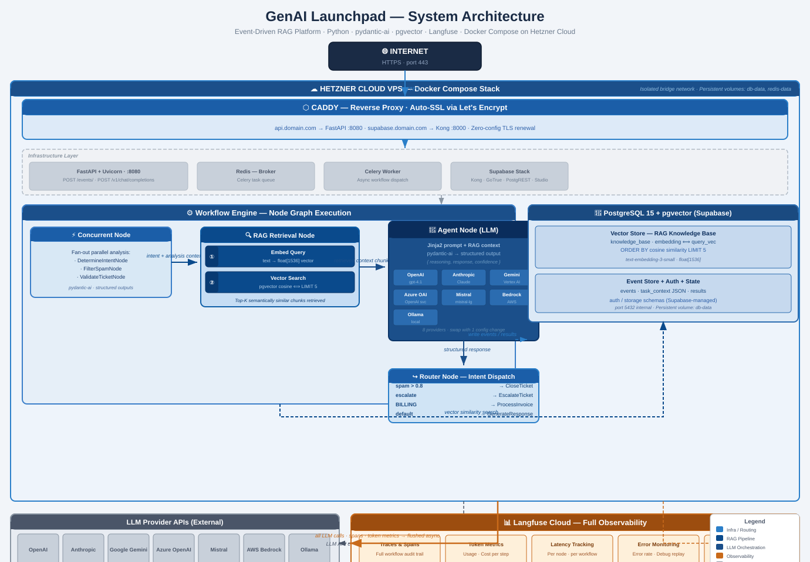

# AI Customer Support Automation Platform - Event-Driven RAG Workflow Engine

??? tip "Portfolio Best Practices"
    This project was built as part of the Datalumina AI Engineering program — a production-focused curriculum designed to bridge backend engineering with modern Generative AI.

!!! abstract "Project Summary"
    **Program**: Datalumina Certified AI Engineer Expert
    **Duration**: Oct 2025 – Mar 2026
    **Role**: AI Engineer Trainee

    **Key Outcomes**:

    - End-to-end RAG application deployed in a production-like environment
    - Full LLM observability with Langfuse tracing
    - Type-safe AI pipelines using Pydantic
    - Sub-second retrieval from PostgreSQL/pgvector
    - Modular FastAPI backend ready for team integration

## Challenge

Customer support teams are buried in repetitive, time-sensitive tickets that follow predictable patterns — billing questions, general enquiries, spam, and issues that genuinely need a human. The cost of handling each ticket manually is high. The cost of handling it wrong (misrouting, slow responses, inconsistent quality) is higher.
Existing off-the-shelf helpdesk AI tools are black boxes: you cannot control how tickets are classified, how responses are generated, which knowledge base is used, or why a decision was made. When something goes wrong in production, there is no trace, no audit trail, and no way to improve the system systematically.
The challenge was to build a fully custom, production-grade support automation platform that: (1) processes incoming tickets asynchronously so the system stays responsive at any volume, (2) runs multiple AI analyses in parallel to classify intent, detect spam, and validate the ticket before any response is generated, (3) retrieves relevant knowledge base content via RAG so responses are grounded in accurate information, (4) routes each ticket to the correct handler based on combined AI outputs, and (5) makes every decision fully observable — every LLM call, every classification, every routing decision logged with inputs, outputs, token counts, and latency.

## Approach

  The platform is built around an event-driven, node-graph workflow engine. Every ticket
  enters the system as an event, is immediately persisted and queued, and is then processed
   by a composable pipeline of typed AI nodes. Five architectural decisions define the
  design:                                                                                  
                                                                                         
  1. Fire-and-forget async ingestion                                                       
  The FastAPI endpoint accepts a ticket, writes it to PostgreSQL, and enqueues a Celery
  task — all within milliseconds. The caller receives HTTP 202 immediately. The Celery     
  worker handles all AI processing in the background, meaning the API stays non-blocking 
  regardless of LLM response times. Redis acts as the message broker between the two.      
                                                                                         
  2. Parallel ticket analysis before any routing decision                                  
  The first node in every ticket workflow is a ConcurrentNode that fans out to three
  independent LLM agents simultaneously:                                                   
    - DetermineIntentNode — classifies the ticket intent (general, billing, escalation, etc.)
   with confidence score                                                                   
    - FilterSpamNode — determines whether the sender is human or automated, with reasoning 
    - ValidateTicketNode — checks whether the ticket contains enough information to act on   
                                                                                           
    All three run in parallel and complete before the router node evaluates their combined   
    outputs. This cuts per-ticket latency compared to sequential analysis and produces a     
    richer decision signal.                                                                  
                                                                                           
  3. RAG retrieval grounded in the same database                                           
  Rather than introducing a separate vector database, pgvector extends the existing
  PostgreSQL instance. Incoming ticket text is embedded and used to run a cosine similarity
   search against the knowledge base (embedding <=> $query_vector). The top-K matching   
  chunks are injected directly into the Jinja2 prompt template as {{ rag_context }} before 
  the response generation LLM call. This keeps retrieval close to the data layer and     
  eliminates an entire infrastructure dependency.

  4. Intent-based routing with deterministic structured outputs
  All LLM calls go through pydantic-ai, which enforces a typed Pydantic model as the return
   value of every agent. The TicketRouterNode evaluates structured fields —                
  spam_confidence, intent, escalate flag — not free text. Routing rules are explicit:
    - Spam confidence > 0.8 → CloseTicketNode                                                
    - escalate == True → EscalateTicketNode                                                  
    - Intent == BILLING → ProcessInvoiceNode
    - Default → GenerateResponseNode → SendReplyNode                                         
                                                                                         
    Because every output is a validated Pydantic model, routing logic is fully deterministic 
    and testable.                                                                            
                                                                                           
  5. Full Langfuse observability wired at the workflow level                               
  Passing enable_tracing=True when instantiating the workflow activates a complete Langfuse
   trace tree with no additional instrumentation code. Every node becomes a span. Every LLM
   call is automatically captured via instrument_all(). Inputs, outputs, token counts,   
  costs, and latencies are recorded at each step. The result is a searchable, replay-able  
  audit trail for every ticket the system has ever processed.                            

  The full stack runs as a six-service Docker Compose project (FastAPI, Celery, PostgreSQL,
   Redis, Caddy, Supabase) behind a Caddy reverse proxy that provisions TLS automatically.
  Deployment to Hetzner Cloud is a single shell command.                                   
                                                           
## Results & Impact

- End-to-end ticket processing automated — from raw email payload to drafted reply — with no human in the loop for standard enquiries
- Parallel analysis reduces per-ticket AI latency...
- Every decision is auditable...
- RAG grounds responses in the actual knowledge base...
- Spam and irrelevant tickets are closed automatically...
- Swappable LLM providers with no code changes...
- Deployed and HTTPS-secured on Hetzner Cloud in under an hour...

## Solution Overview

*End-to-end RAG architecture with retrieval, LLM orchestration, and observability*

## Tech Stack

- Python & FastAPI
- PostgreSQL with pgvector (vector similarity search)
- PydanticAI (type-safe AI pipelines)
- Pydantic AI (LLM orchestration)
- Async Task Queue: Celery 5 + Redis
- Langfuse (LLM observability and tracing)
- OpenAI / Claude (LLM providers)
- Docker (containerization)
- GitHub Actions (CI/CD)
- Cloud Hosting: Hetzner Cloud VPS

## Additional Context

- Timeline: 6 months (as part of Datalumina program)
- Role: AI Engineer (solo)
- Focus: Production-grade reliability, not just prototyping
- Engineering practices: Pydantic type safety, structured logging, modular design

-   :material-email:{ .lg .middle } Interested in similar work?

    ---

    I'd love to discuss how a RAG-based solution could work for your team's data and workflows.

    [Email Me :material-arrow-top-right:](mailto:gayithri@pojoai.com){ .md-button .md-button--primary }

