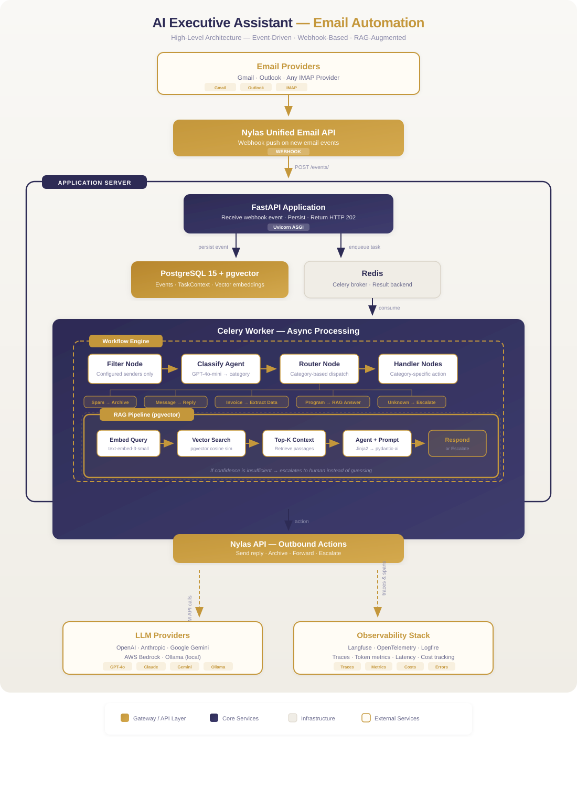

# AI Executive Assistant — Intelligent Email Automation Platform

??? tip "Portfolio Best Practices"
    This project was built as an independent initiative — a real-world productivity tool and a reference implementation for teams learning to build production AI systems.

!!! abstract "Project Summary"
    **Type**: Personal / Independent Project
    **Duration**: 2025 – 2026
    **Role**: AI Engineer (Solo)

    **Key Outcomes**:

    - Fully autonomous email triage — no human in the loop for routine messages
    - Custom node-based workflow engine powering composable AI pipelines
    - RAG pipeline with hallucination prevention via vector-grounded responses
    - Multi-provider LLM support (OpenAI, Claude, Gemini, Bedrock, Ollama) with one-line config swap
    - Full observability via OpenTelemetry and Langfuse tracing

## Challenge

Professionals and entrepreneurs spend an enormous amount of time managing email — triaging, categorizing, responding, and escalating. Inspired by Dan Martell's *Buy Back Your Time*, the challenge was to build an AI system that could autonomously monitor an inbox, understand the intent of each email, and take the right action — all without manual intervention.

The core difficulty: email is unstructured, highly variable, and context-dependent. A naive rule-based system would break constantly. The solution needed to be intelligent, reliable, and extensible enough to grow with new use cases.

## Approach

The platform is a production-grade, event-driven AI automation system built from scratch — not a wrapper around an existing tool, but a proper distributed system with a custom workflow engine at its core.

**1. Webhook-driven async ingestion**

The FastAPI endpoint receives email events via Nylas webhooks (supporting both Gmail and Outlook), persists the raw event to PostgreSQL, and enqueues a Celery task — all within milliseconds. The caller receives HTTP 202 immediately. All AI processing happens asynchronously via Celery workers backed by Redis as the message broker. The API stays non-blocking regardless of LLM response times.

**2. Custom node-based workflow engine**

Rather than hard-coding logic, the platform uses a declarative, node-based workflow engine. Each workflow is defined as a schema of chained nodes that can be composed and extended:

- **AgentNodes** — LLM-powered steps (classify, analyze, compose responses)
- **RouterNodes** — conditional branching based on prior node output
- **ParallelNodes** — concurrent execution for independent steps

A shared TaskContext object flows through the entire pipeline, letting every node read from and write to a single source of truth.

**3. Email processing pipeline**

The live workflow processes every incoming email through four stages:

- **Filter** — only process emails from configured senders
- **Classify** — GPT-4o-mini categorizes each email: SPAM, MESSAGE, INVOICE, PROGRAM_QUERY, or OTHER
- **Route** — a router node dispatches to the appropriate handler based on classification
- **Handle** — category-specific nodes take action: spam is archived, messages get auto-replies, invoices have attachments downloaded and data extracted via Docling, and program queries are answered via the RAG pipeline

**4. RAG pipeline for vector-grounded responses**

For program-related queries, the AI agent does not hallucinate — it performs a semantic similarity search over a PostgreSQL vector store (pgvector) populated with program transcripts and documentation. If confidence is insufficient, the system escalates to a human instead of guessing. Embeddings are generated using OpenAI text-embedding-3-small (1536-dim).

**5. Full observability built-in**

Every workflow execution is traced via OpenTelemetry and Langfuse, giving full visibility into LLM inputs/outputs, token counts, latency, costs, and decision paths. Every node becomes a span in the trace tree, making debugging and systematic improvement possible.

## Results & Impact

- **Fully autonomous email triage** — no human in the loop for routine messages
- **Intelligent escalation** — AI knows when it cannot answer and routes to a human rather than hallucinating
- **Zero-latency webhook response** — HTTP 202 returned immediately; all processing is deferred asynchronously
- **Multi-provider flexibility** — the same workflow runs on OpenAI, Anthropic Claude, Google Gemini, AWS Bedrock, or local Ollama models with a one-line config change
- **Extensible by design** — new email categories, new workflows, and new integrations (calendar, Slack) can be added without touching core engine code

## Solution Overview

*End-to-end event-driven architecture: webhook ingestion, async processing, AI workflow engine, and action execution*

## Tech Stack

- **Python 3.13** — core language
- **FastAPI** — REST API and webhook receiver
- **Celery 5 + Redis** — async distributed task queue
- **SQLAlchemy + Alembic** — ORM and database migrations
- **Pydantic v2** — data validation throughout
- **PydanticAI** — multi-provider LLM agent framework
- **OpenAI GPT-4o / GPT-4o-mini** — primary LLM providers
- **Anthropic Claude / Google Gemini / AWS Bedrock / Ollama** — supported via PydanticAI
- **PostgreSQL 15 + pgvector** — primary database and vector similarity search for RAG
- **Nylas API** — unified email and calendar abstraction layer
- **Docling** — document and attachment parsing
- **Langfuse + OpenTelemetry + Logfire** — LLM tracing, distributed tracing, structured logging
- **Docker + Docker Compose** — full containerized deployment
- **Jinja2 + python-frontmatter** — templated system prompts with metadata management

## Additional Context

- Timeline: Ongoing personal project (2025–present)
- Role: AI Engineer (solo — architecture, implementation, deployment)
- Focus: Production-grade reliability, not just prototyping
- The architecture was intentionally designed to demonstrate enterprise-grade patterns — event-driven async processing, RAG with hallucination prevention, multi-provider LLM abstraction, and full observability — in a domain every professional immediately understands
- The codebase is built for extensibility: adding a new email category requires only a new node class and a one-line registry entry. The same workflow engine can power calendar automation, Slack triage, or any other event-driven use case

-   :material-email:{ .lg .middle } Interested in similar work?

    ---

    I'd love to discuss how an AI automation platform could work for your team's workflows.

    [Email Me :material-arrow-top-right:](mailto:gayithri@pojoai.com){ .md-button .md-button--primary }

